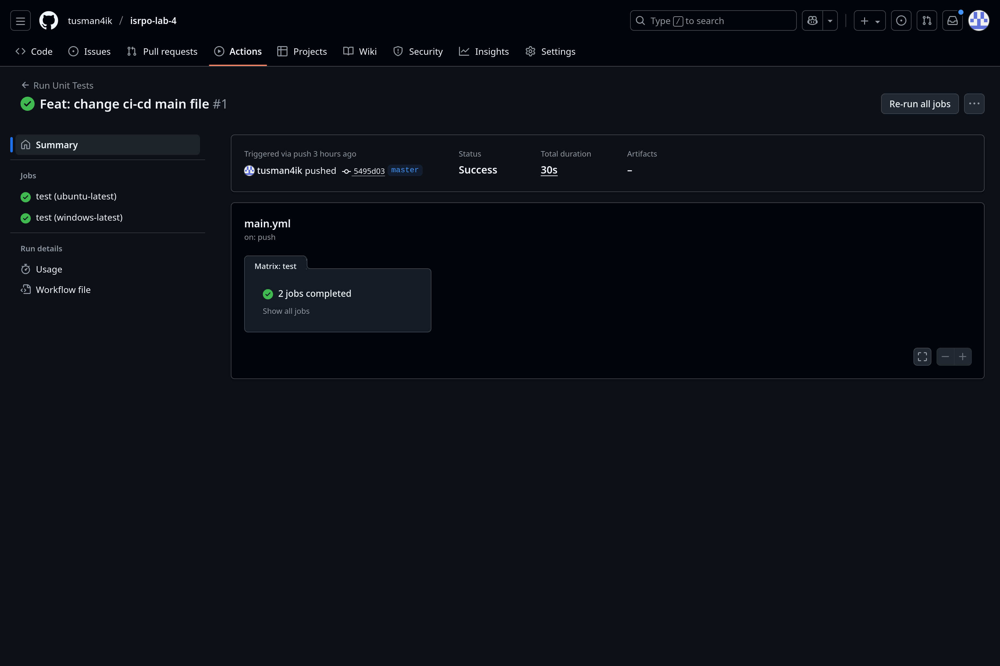

# Лабораторная работа №5
# Знакомство с CI/CD

**Студент:** Котельников Олег, M3104, isu 501418  
**Преподаватель:** Повышев Владислав Вячиславович
**Дата:** 2025 год

## Workflow файл

`.github/workflows/main.yml`:
```yaml
name: Run Unit Tests

on: [push]

jobs:
  test:
    runs-on: ${{ matrix.os }}
    strategy:
      matrix:
        os: [ubuntu-latest, windows-latest]
    
    steps:
    - name: Checkout code
      uses: actions/checkout@v4
      
    - name: Set up Python
      uses: actions/setup-python@v4
      with:
        python-version: '3.x'
        
    - name: Run unit tests
      run: |
        python -m unittest discover -s tests -v
```

Workflow успешно запускает unit-тесты на двух runner'ах после каждого push в репозиторий.
